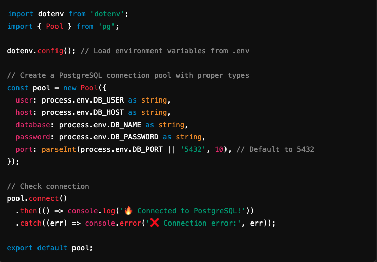
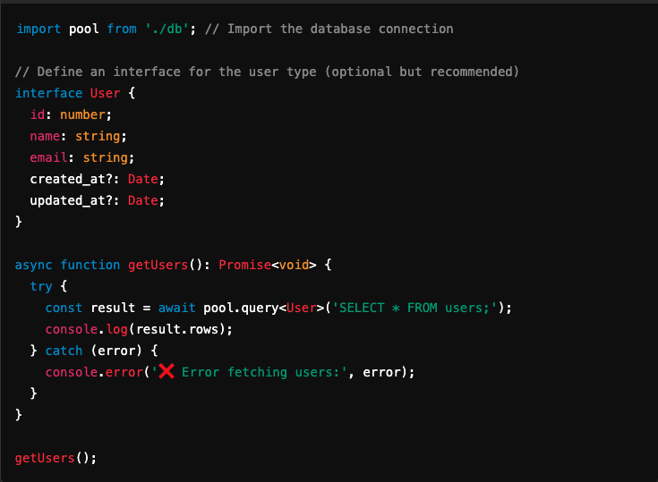

# Authentication Project
experiment repo for authentication

## Setting up this Project

### Install Node.js

**Before installing dependencies, ensure you have Node.js installed globally.**
👉 Download Node.js [(LTS version recommended)](https://nodejs.org/en)

**After installation, verify it's installed correctly by running:**  
  👉 node -v  

  **Check Node.js version**  
  👉 npm -v

#### Install Project Dependencies
**Once Node.js is installed, navigate to the project folder and install dependencies:** 
    👉 npm install  
   
### Install React  
**This project uses React. To install React and ReactDOM, run:**
    👉 npm install react react-dom  

#### If setting up a new React project, use:  
    👉 npx create-react-app my-app
    👉 cd my-app
    👉 npm start  

### Install TypeScript:  
**This Project uses TypeScript (TS). To install TypeScript globally, run:**  
    👉 npm install -g typescript  

**or, if your computer is like mine and is giving you a difficult time with permissions**  
    👉 sudo npm install -g typescript  
  
**Then enter your password when prompter. After that, check installation:**  
    👉 tsc -v  
  
### Install PostgreSQL:  
  
#### If you haven't installed PostgreSQL from the official site:  
    👉 (PostgreSQL Official Download)[https://www.postgresql.org/download/]  
  
**After installation, verify that it's working:**  
    👉 psql --version  
  
**You should see something like:**  
    👉 psql (PostgreSql) 15.x.x  
  
#### Install pg (PostgreSQL Client for Node.js):  
     👉 npm install pg  
  
**For Typescript projects, also install types:**  
        👉 npm install --save-dev @types/pg  
  
### Set up a .env file for Database Credentials:  
**Create a .env file in your project root and add your PostgreSQL connection details:**    

    DB_HOST=localhost  
    DB_USER=your_username  
    DB_PASSWORD=your_password  
    DB_NAME=your_database  
    DB_PORT=5432    

**💡 Replace your_username, your_password, and your_database with your actual PostgreSQL credentials.**  
  
### Create a Database in PostgreSQL:  
**Log into PostgreSQL in your terminal:**  
    👉 psql -U your_username  
  
**Then create a database for your project:**  
    👉 CREATE DATABASE your_database;    

**Check if it was created successfully:**  
    👉 \l  
        
### Connect Node.js to PostgreSQL  
**Now, in your backend, create a db.ts file to manage database connections: (see example)**    

    
      
### Use the Database in your project:  
**Now, you can query PostgreSQL using the example above**  
E.g. getUsers.ts

  
  
### Start the project:  
    👉 npm start  
      
**If PostgreSQL is working correctly, you should see:**
    Connected to PostgreSQL!  
      
### Final Checklist:  
✅ PostgreSQL is installed  

✅ pg package is installed  

✅ .env file is set up  

✅ Database is created  

✅ Node.js connects to PostgreSQL  

✅ Queries work correctly  

